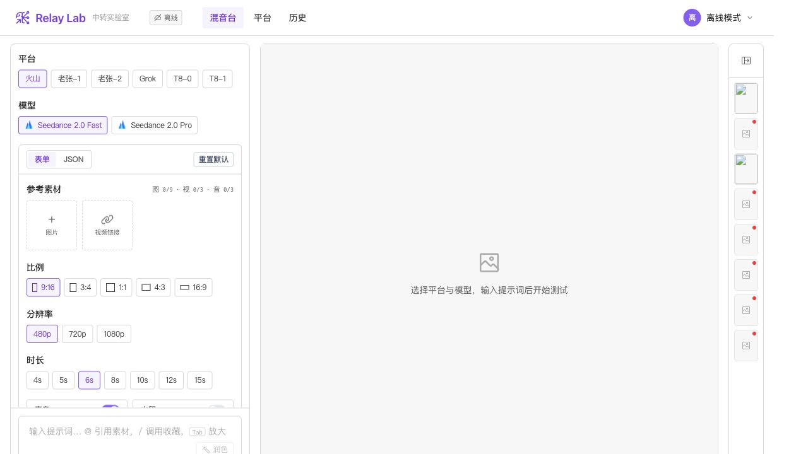
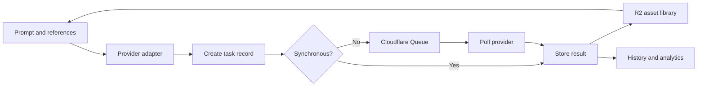

<div align="center">

# Relay Lab

**A unified console for testing, comparing, and tracing image, video, and text generation APIs across providers.**

[Open Relay Lab](https://relay.yiheng.run) · [Report an issue](https://github.com/guoyiheng/relay-lab/issues)


</div>

<p align="center">
  
</p>

## Overview

Relay Lab gives multiple relay platforms and model APIs one consistent operating surface. Configure providers, select a model, attach reference media, tune generation parameters, submit a task, and inspect the request, response, cost, duration, and reusable outputs without switching tools.

### Features

- **Unified model console** for image, video, and text generation.
- **Provider adapters** for OpenAI-style sync and async APIs, xAI image endpoints, and Doubao/Seedance video tasks.
- **Reference asset library** for images, videos, audio, remote URLs, and previously generated results.
- **Persistent asynchronous jobs** backed by Cloudflare Queues with polling and recovery after refresh.
- **Task history and comparison** across providers, models, latency, status, and price snapshots.
- **Prompt tools** for polishing, analysis, favorites, and reusable commands.
- **Online and offline modes** with browser-local provider configuration when a server account is not used.
- **Cloud-native storage** with D1 for structured data and R2 for uploaded and generated assets.

## Request Lifecycle



## Quick Start

Requirements: Node.js, pnpm 10, and Wrangler authentication for remote Cloudflare bindings.

```bash
pnpm install
pnpm dev
```

By default, `wrangler.jsonc` enables remote D1 and R2 bindings. Local development therefore reads and writes the configured Cloudflare resources. Use a dedicated development environment or set the bindings to local mode before experimenting with destructive operations.

Run validation:

```bash
pnpm test
pnpm typecheck
pnpm build
```

Apply database migrations and deploy:

```bash
pnpm d1:migrate:remote
pnpm deploy
```

## Project Structure

```text
relay-lab/
├── app/
│   ├── components/    # Console, task, result, and asset UI
│   ├── composables/   # Auth, data, downloads, prompts, and assets
│   ├── datasource/    # Online and offline data adapters
│   ├── pages/         # Console, providers, history, profile, and analytics
│   └── stores/        # Provider, task, and history state
├── server/
│   ├── api/           # Nuxt server endpoints
│   ├── middleware/    # Authentication and request security
│   └── utils/         # Adapters, queues, storage, and task execution
├── migrations/        # Cloudflare D1 schema migrations
├── shared/            # Shared request utilities
├── types/             # API contracts
└── wrangler.jsonc     # Worker, D1, R2, Queue, and route bindings
```

## Technology Stack

| Layer | Technology |
| --- | --- |
| Application | Nuxt 4, Vue 3, TypeScript |
| Interface | Nuxt UI 4, Tailwind CSS 4, Carbon Icons |
| Client state | Pinia |
| Server | Nitro / h3 on Cloudflare Workers |
| Structured data | Cloudflare D1 |
| Media storage | Cloudflare R2 |
| Background jobs | Cloudflare Queues |
| Testing | Vitest |

## License

Licensed under the [Apache License 2.0](https://www.apache.org/licenses/LICENSE-2.0).

<p align="center">© 2026 yiheng</p>
